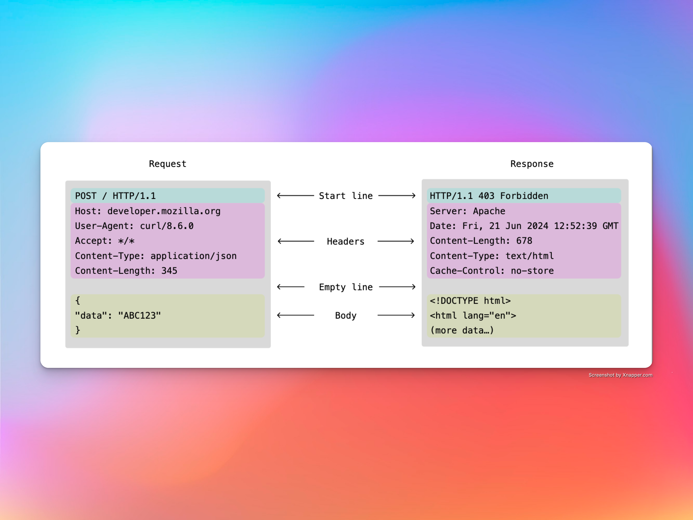

### notes about HTTP/1.1

#### the http protocol is built on top of the TCP transport layer, and its primary mode of communication is via raw TCP sockets, and all other functionality is all logical, extended on the idea of TCP sockets

#### here, a mock browser is implemented, which can only send reqs to this server built right here(for now, cant be sent to other servers as they use other versions of http, which are more robust, and hence they dont fit in with this standard of http/1.1 used here). When the url of the server is entered in this broswer with the endpoint and a body(in case of a post req) it is sent first of all to be formatted in the format of http/1.1 reqs, after that the body, if present, is also lexed to find the type of the body, that might be plain text, html code, json code.

#### after this the req is broken into 512B of data chunks and sent across the TCP socket to the server, which is listening for incoming reqs, when it does find one, it opens up a new server side client socket and begins the communication, which in the standard case lasts for only 1 exchange, and then the client socket closes, and so does the server side client socket. When the server now gets a new req, the same process is followed. This process of opening client sockets and sending messages to the server through it is automated by browser.

#### then the server acts on this req. If the req is of GET type, then it looks at the endpoint(which in this case will be a file with an extension) and located and reads this file. In this case, all the servable files are located in the servableFiles directory, and as such is searched only in this dir. It handles all the the staus codes like 200 OK, 404 Not Found and a few more. In case of a POST req, it looks at the endpoint, which in this case can be /save or /delete where /save saves something to a fixed file which is decided by the server itself (posted_info.txt) and in case of /delete endpoint it deletes all the info in that fixed file. 

#### after all that, a response is sent based on the actions taken by the server script and it formats it according to the standards of http/1.1, and sends it to the client, after which both close their sockets.

#### the req and res formats in http/1.1

#### so go ahead and give it a run!